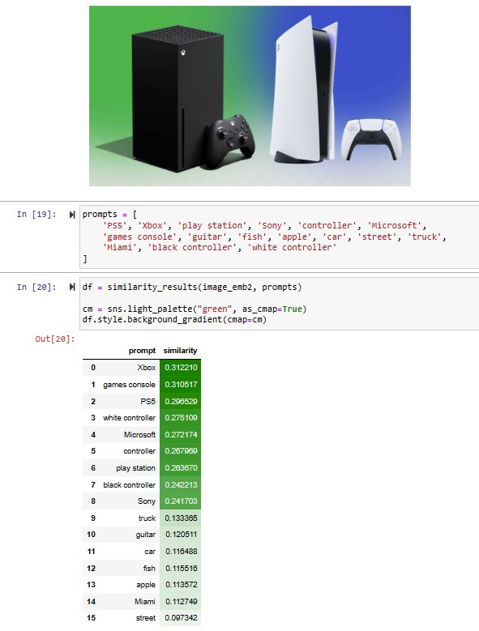

# Image retrieval with Azure Computer Vision V4.0 (Public Preview) using vector embeddings

**Vector embeddings** are a way of representing content—text or images—as vectors of real numbers in a high-dimensional space. Vector embeddings are often learned from large amounts of textual and visual data using machine learning algorithms, such as neural networks. Each dimension of the vector corresponds to a different feature or attribute of the content, such as its semantic meaning, syntactic role, or context in which it commonly appears.

- **Vectorize Images and Text:** the Image Retrieval APIs, VectorizeImage and VectorizeText, can be used to extract feature vectors out of an image or text respectively. The APIs return a single feature vector representing the entire input.

- **Measure similarity**: Vector search systems typically use distance metrics, such as cosine distance or Euclidean distance, to compare vectors and rank them by similarity. The Vision studio demo uses cosine distance to measure similarity.

- **Retrieve Images:** Use the top N vectors similar to the search query and retrieve images corresponding to those vectors from your photo library to provide as the final result.

## Python demo notebook
<a href="https://github.com/retkowsky/image_retrieval_with_Azure_Computer_Vision_4.0/blob/main/Image%20retrieval%20(version%204.0%20preview)%20with%20Azure%20Computer%20Vision.ipynb">Python demo notebook</a>

## Some examples

### Example 1

### Example 2

10-Mar-2023 Serge Retkowsky | serge.retkowsky@microsoft.com | https://www.linkedin.com/in/serger/
